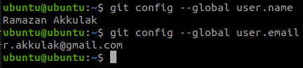
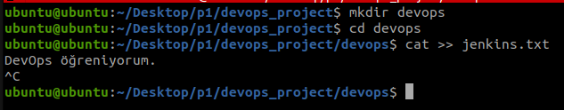
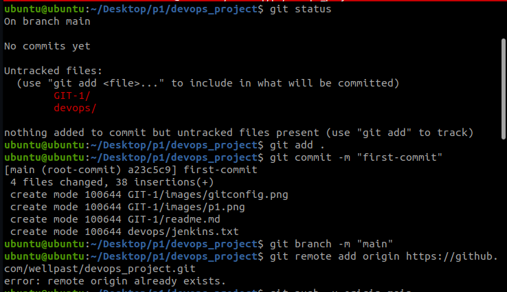
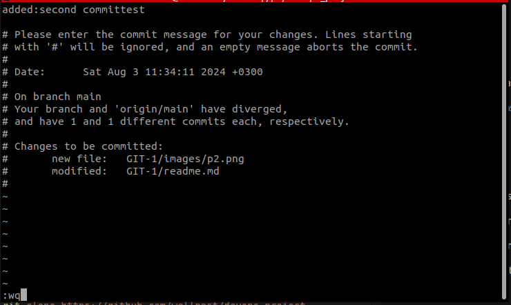
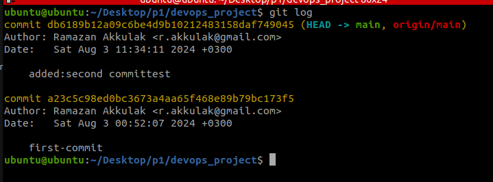
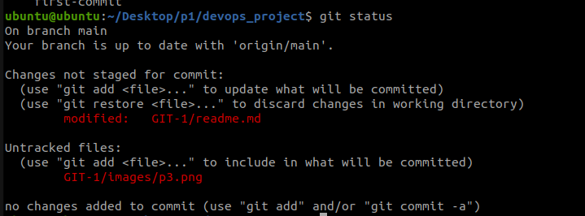

## 5.adım: Git nedir ? VCS açılımı nedir ? iyi bir commit özelliklkeri nelerdir ?

- Git, projelerindeki dosyaların geçmişini takip etmene yardımcı olur. Her yaptığın değişiklik kaydedilir, bu sayede eski sürümlere kolayca dönebiliriz.

- Ekip Çalışmasını Kolaylaştır: Bir projede birden fazla kişiyle çalışıyorsa, Git sayesinde herkes kendi üzerinde çalışabilir ve sonra bu çalışmaları projeye kolayca ekleyebilirsin.


## 6.adım: git ayarlarınını user.name, user.password yapalım

```bash
git config --global user.name "Ramazan Akkulak"
git config --global user.email "r.akkulak@gmail.com"
```




## 7.adım: Linux komutlarıyları dizin adı "devops" ve dosya adı "jenkins.txt" oluşturalım ve "DevOps öğreniyorum" yazalım.

```bash
mdkir devops
```

```bash
cd devops
```

```bash
cat >> jenkins.txt
```

```bash
cat >> jenkins.txt
DevOps öğreniyorum.
```




## 7.adım: Git staged area ve unstaged area nedir ?

- Staged Area: Git'te, bir sonraki commit'e dahil edilmek üzere seçtiğin değişikliklerin bulunduğu alandır.

- Unstaged Area: Dosyalarda yapılan değişikliklerin kaydedildiği ancak henüz commit'e eklenmek üzere seçilmediği alandır.

## 8.adım: bu dizindeki dosyaları oluşturduğumuz github repository gönderelim. NOT: main adında branch
oluşturalım.

```bash
git add .
```

```bash
git commit -m "first commit"
```

```bash
git branch -M "main"
```

```bash
git remote add origin https://github.com/wellpast/devops_project.git
```
```bash
git push -u origin main
```



## 9.adım: oluşturduğumuz github repository local bilgisarımızda bir yere clone yapalım

```bash
git clone https://github.com/wellpast/devops_project
```

## 10.adım: en son commitimizin commit içeriğini değiştirilelim.

```bash
git add
```

```bash
git commit --amend
```

```bash
git push --force
```



## 11.adım: git log ve git status ne iş yapıyordu ?

- git log: Depodaki commit geçmişini gösterir, yani hangi değişikliklerin, kim tarafından, ne zaman yapıldığını listeleyen bir günlük sunar.

- git status: Çalışma dizinindeki değişikliklerin durumunu gösterir, yani hangi dosyaların değiştirildiğini, stage edilip edilmediğini ve hangi branch'te olduğunu bildirir.

```bash
git log
```


```bash
git status
```


## 12.adım: backend adında branch oluşturalım. bu branche bir takım dizinler ekleyelim. commit yapalım merge işleminde fast-forward yapalım 