## TECHCAREER DEVOPS BİTİRME PROJESİ
## 1.adım: Sanal Makine üzerinde (VMBOX) Linux Ubuntu 22.0.4 LTS kuralım (Eğer Linux ve/veya Mac varsa Sanal makine kurmanıza gerek yok)

## 2.adım: kurulumları yapalım.

Git,JDK-11 , Maven, Apache Tomcat, Docker, Visual Studio codes, derste yüklediğimiz pluginleri yükleyelim (GitHub,maven,deployment vs.)

## 3.adım: port ayarları her bir uygulama için farklı portta olduğununda emin olalım ➔ Linux komut terminalinden derste yaptımız.

```bash
netstat -nlptu
```

## 4.adım: GitHub repository üzerinden devops_project adında repository açalım.

#### GitHub repository ReadMe.md adında dosya oluşturulun uygun formatta yazalım sonrasında local bilgisayarımızda pull yapalım


## 5.adım: Git nedir ? VCS açılımı nedir ? iyi bir commit özelliklkeri nelerdir ?

- Git, projelerindeki dosyaların geçmişini takip etmene yardımcı olur. Her yaptığın değişiklik kaydedilir, bu sayede eski sürümlere kolayca dönebiliriz.

- Ekip Çalışmasını Kolaylaştır: Bir projede birden fazla kişiyle çalışıyorsa, Git sayesinde herkes kendi üzerinde çalışabilir ve sonra bu çalışmaları projeye kolayca ekleyebilirsin.


## 6.adım: git ayarlarınını user.name, user.password yapalım

```bash
git config --global user.name "Ramazan Akkulak"
git config --global user.email "r.akkulak@gmail.com"
```

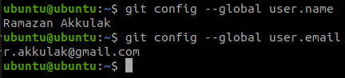


## 7.adım: Linux komutlarıyları dizin adı "devops" ve dosya adı "jenkins.txt" oluşturalım ve "DevOps öğreniyorum" yazalım.

```bash
mdkir devops
```

```bash
cd devops
```

```bash
cat >> jenkins.txt
```

```bash
cat >> jenkins.txt
DevOps öğreniyorum.
```

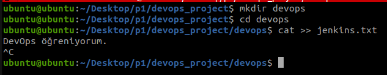


## 7.adım: Git staged area ve unstaged area nedir ?

- Staged Area: Git'te, bir sonraki commit'e dahil edilmek üzere seçtiğin değişikliklerin bulunduğu alandır.

- Unstaged Area: Dosyalarda yapılan değişikliklerin kaydedildiği ancak henüz commit'e eklenmek üzere seçilmediği alandır.

## 8.adım: bu dizindeki dosyaları oluşturduğumuz github repository gönderelim. NOT: main adında branch
oluşturalım.

```bash
git add .
```

```bash
git commit -m "first commit"
```

```bash
git branch -M "main"
```

```bash
git remote add origin https://github.com/wellpast/devops_project.git
```
```bash
git push -u origin main
```
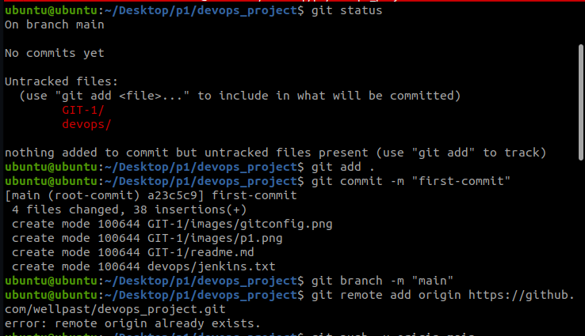


## 9.adım: oluşturduğumuz github repository local bilgisarımızda bir yere clone yapalım

```bash
git clone https://github.com/wellpast/devops_project
```

## 10.adım: en son commitimizin commit içeriğini değiştirilelim.

```bash
git add
```

```bash
git commit --amend
```

```bash
git push --force
```
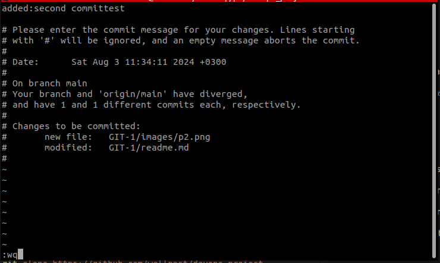


## 11.adım: git log ve git status ne iş yapıyordu ?

- git log: Depodaki commit geçmişini gösterir, yani hangi değişikliklerin, kim tarafından, ne zaman yapıldığını listeleyen bir günlük sunar.

- git status: Çalışma dizinindeki değişikliklerin durumunu gösterir, yani hangi dosyaların değiştirildiğini, stage edilip edilmediğini ve hangi branch'te olduğunu bildirir.

```bash
git log
```
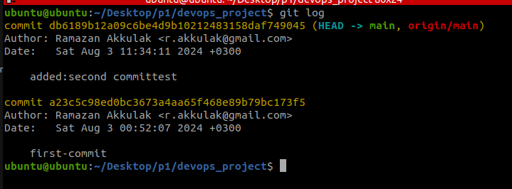

```bash
git status
```
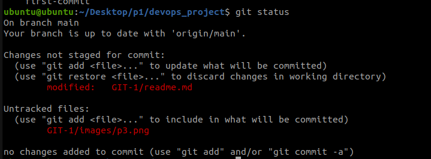

## 12.adım: backend adında branch oluşturalım. bu branche bir takım dizinler ekleyelim. commit yapalım merge işleminde fast-forward yapalım 

```bash
git add .
git commit -m "merge öncesinde commit"
git branch backend
git checkout backend
git add .
git commit -m "backend"
git checkout main
git merge backend
```
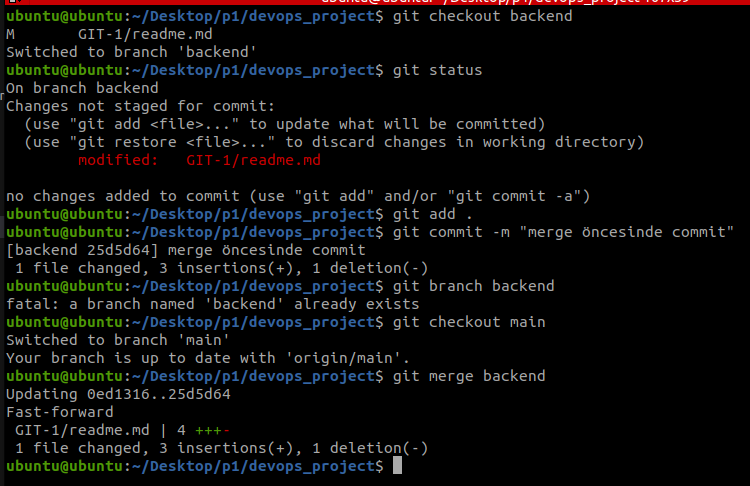

##  13.adım: Git GUI ve Git CLI nedir ? 

- Git GUI: Git komutlarını görsel bir arayüz üzerinden kullanmanı sağlayan, işlemleri interactive yapabileceğin bir yazılımdır.
- Git CLI: Git komutlarını terminal veya komut satırı üzerinden yazarak kullanmanı sağlayan, daha doğrudan ve esnek bir yöntemdir.

## 14.adım: frontend adında branch oluşturalım. bu branche bir takım dizinler ekleyelim. commit yapalım 

- merge işleminde no-fast-forward yapalım 


```bash
git checkout -b frontend
git status
git add .
git commit -m "merge öncesinde commit"
git merge fronend --no-ff
```

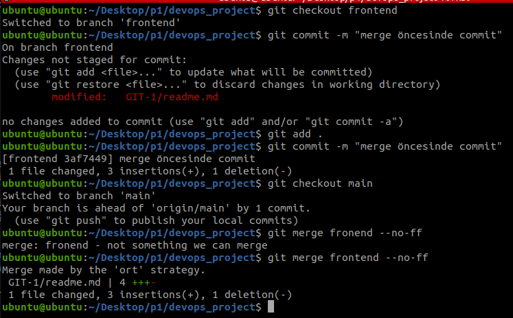

## 15.adım: Başka bir github repository açalım ve bu sefer derste öğrendiğimiz SSH-KEY ile github veri gönderme yapalım


```bash
cd ~/.ssh
```

```bash
mkdir ~/.ssh
> cd ~/.ssh
```

```bash
ssh-keygen -t rsa -C "Ramazan Akkulak"
```

Enter file in which to save the key (/Users/YourName/.ssh/id_rsa): [Press enter]

```bash
nano config
```

```bash
IdentityFile ~/.ssh/'Ramazan Akkulak'
```

```bash
ssh -T git@github.com 
```

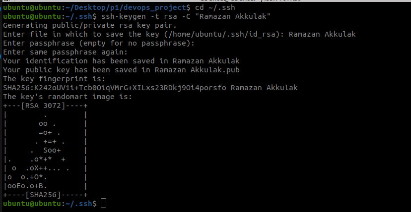
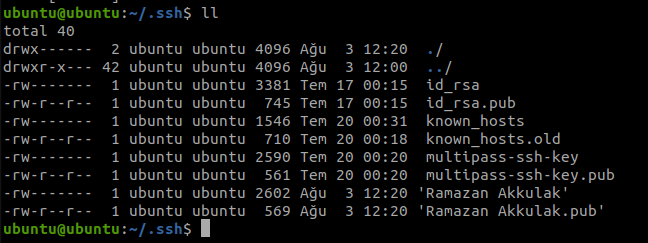
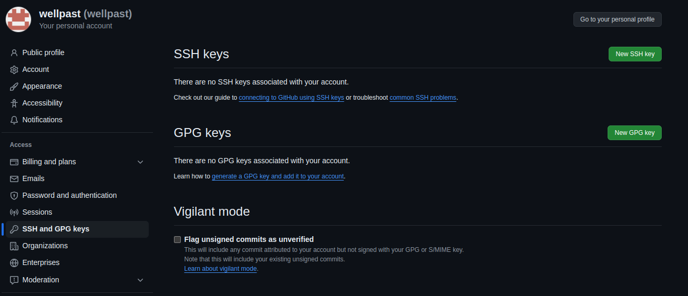

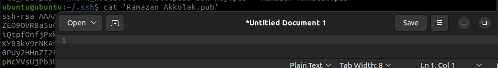
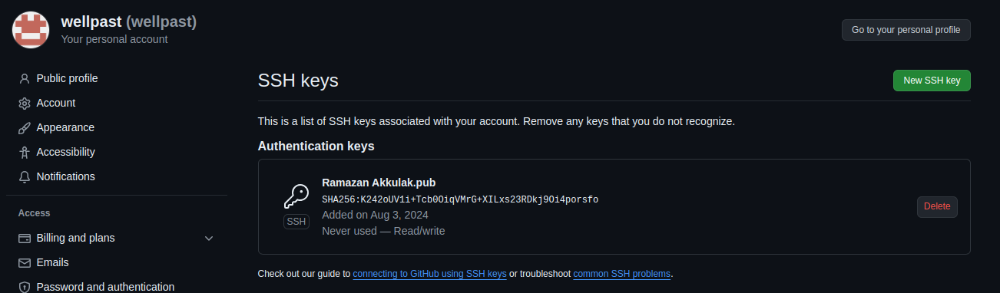
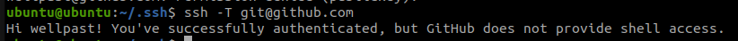


## 16.adım: git stash nedir ?

- git stash: Üzerinde çalıştığın ve henüz commit etmediğin değişiklikleri geçici olarak saklayıp çalışma dizinini temizlemeni sağlayan bir Git komutudur, böylece başka bir branch'e geçiş yapabilirsin.

## 17.adım: projelerimizi pushlama yaparken acil.txt adında bir iş geldi ve bu iş öncelik olduğu söylendi var olan add yapılmış dosyalarımızı commitleme yapmadan özel bir alanda saklama yapalım tabi bunu git stash ile yapalım.

```bash
git add .
git commit -m "stash sonrası commit"
git push -u origin main
git stash pop
git add .
git commit -m "pop_stash"
git push -u origin main
```

## 18.adım: git log --all --oneline --decorate --graph komutunu graph adından alias kullanarak kısaltalım

```bash
git config --global alias.graph "log --all --graph --decorate --oneline"
git graph
```
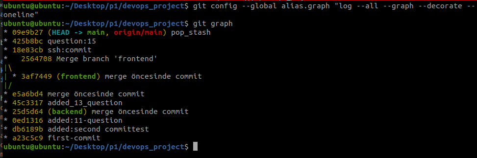

## 19.adım: Rebesa ile merge arasındaki fark nedir ?

- Rebase: Bir branch'in tabanını başka bir branch'in sonuna taşıyarak, daha temiz bir commit geçmişi oluşturur.
- Merge: İki branch'i birleştirerek, her iki branch'in değişikliklerini yeni bir commit ile birleştirir ve commit geçmişini olduğu gibi korur.

## 20.adım: Git Conflict nedir ? Bir conflict yediğimizde ne yapmamız gerekiyor ?

- Git Conflict: İki branch'i birleştirirken (merge veya rebase sırasında) aynı dosyanın aynı kısmında farklı değişiklikler olduğunda ortaya çıkan bir çakışmadır.

#### Conflict'le Karşılaşınca:

- Git, çatışan dosyaları işaretler ve çözmen için bu dosyaları düzenlemen gerekir.
Çatışmayı elle çözüp, dosyayı kaydetmelisin.
Ardından,  dosyaları stage ederek git add <dosya_adi> komutuyla eklenmeli ve git commit komutunu kullanarak son durum kayıt edilmelidir. Ayrıca burada kullanılan editörler var bu editörler conflict durumlarda merge editör açarak işleri kolaylaştırır.

## 21.adım: git ignore nedir ?

```bash
mkdir .gitignore
```
- .gitignore: Belirli dosya ve dizinlerin Git tarafından takip edilmemesini sağlayan, bu dosyaları versiyon kontrolüne dahil etmemek için kullanılan bir dosyadır.

## 22.adım: git tag v1.1 ? Bu komu ne iş yapar ?

- git tag v1.1: Depodaki mevcut commit'e v1.1 adında bir etiket (tag) ekler, böylece bu commit'i kolayca referans alabiliriz.

## 23.adım: git diff 3b2f0ab 5a2b8de bu komu ne iş yapar ? 

- git diff 3b2f0ab 5a2b8de: 3b2f0ab ve 5a2b8de commit'leri arasındaki farkları gösterir, yani bu iki commit arasında yapılan değişiklikleri satır satır karşılaştırır.


## 24.adım: DevOps kültür felsefesi nedir ?

- DevOps, uçtan uca hizmet sunumunu ve operasyonlarını optimize etmeye ve yönetmeye yönelik yeni bir yaklaşımdır. Teknolojinin mümkün kıldığı yeni uygulamaları tanıtmak amacıyla tüm yazılım dağıtım yaşam döngüsünü dönüştürmek için bir dizi ilkeyi uygular.

- Yazılım geliştirme ve deployment süreçlerini hızlandırmak, güvenilirliği artırmak ve verimliliği yükselterek yazılım ürünlerini daha hızlı sunmaktır. DevOps, yazılım geliştirme ve operasyon ekiplerinin işbirliğini teşvik eder, otomasyonu kullanır, sürekli entegrasyon ve dağıtımı benimser ve sürekli iyileştirme süreçlerini teşvik eder.

## 25 .adım: DevOps açılımı ?
- Süreçleri daha stabil hale getiren bir hareket.

- IT içerisinde bulunan hem developer takımı hem de operasyon takımı tarafından çalışanların işbirliğini ortaya çıkaran ve bu iş birliğiyle süreçleri daha hızlı gelişmesi sağlayan bir kapsamdır.

- Ana teması: İLETİŞİM VE İŞBİRLİĞİ

- DevOps süreçlerinden AGILE tam entegre çalışır.

## 26.adım: DevOps Yöntemlerinden Continous /Continoues Delivery-Deployment süreçler hakkında bildilerimizi yazalım 

#### Continuous Integration, Continuous Testing, Continuous Delivery, Continuous Operation

- Ortak sorumluluk ve işbirliği kültürü
- Hizmetlerin baştan sona sahipliği
- Çok disiplinli ekipler
- Artan değer teslimi
- Teslimatta akış optimizasyonu
- Hemen hemen her şeyi otomasyon
- Her şeyin ölçülmesi
- Sürekli iyileştirm

## 27.adım: DevOps Yöntemlerinden git nedir ?

- Git, dağıtık bir versiyon kontrol sistemidir; yazılım geliştirme süreçlerinde kaynak kodunu yönetir, değişikliklerin takibini yapar ve ekipler arasında işbirliği sağlar. Git, her bir commit'in tam bir geçmişini saklar ve dallanma (branching) ile birleştirme (merging) gibi özelliklerle esnek ve etkili bir geliştirme süreci sunar.

## 28.adım: DevOps Yöntemlerinden Agile nedir ?

- Agile, yazılım geliştirmede esnek ve iteratif bir yaklaşımı temsil eder; projeleri küçük, yönetilebilir parçalara böler ve sürekli geri bildirim alarak geliştirme sürecini optimize eder. Bu yöntem, değişen gereksinimlere hızlı yanıt verme ve müşteri memnuniyetini artırma odaklıdır.

## 29.adım: DevOps Continues monitoring nedir ?

- Continuous Monitoring (Sürekli İzleme), yazılım ve altyapının performansını, güvenliğini ve sağlığını sürekli olarak izlemeyi ifade eder; bu süreç, olası sorunları erken tespit etmek ve hızlıca müdahale etmek için sürekli veri toplar ve analiz eder.

## 30.adım: Aşağıdaki içeriklerin açılımları ve ne olduğunu yazalım. ?
- XML nedir ?

XML (eXtensible Markup Language): Verileri yapılandırılmış bir şekilde tanımlamak için kullanılan bir işaretleme dilidir, metin tabanlı ve hiyerarşik bir yapı sunar.

- JSON nedir ?

JSON (JavaScript Object Notation): Verileri hafif ve kolay anlaşılır bir formatta temsil eden bir veri değişim biçimidir; genellikle web uygulamalarında veri alışverişi için kullanılır.

- Yaml nedir ?

YAML (YAML Ain't Markup Language): Verileri insan tarafından okunabilir bir formatta tanımlayan bir yapılandırma dilidir; genellikle konfigürasyon dosyalarında kullanılır.

- http nedir?

HTTP (Hypertext Transfer Protocol): Web üzerinde veri iletimi için kullanılan bir protokoldür; web tarayıcıları ile sunucular arasında veri alışverişini sağlar.

- server nedir ?

Server (Sunucu): Ağa bağlı diğer bilgisayarlara hizmet veya kaynak sunan bir bilgisayar veya yazılımdır; veri depolama, uygulama barındırma veya diğer hizmetleri sağlayabilir.

- Java JDK,JRE,JVM nedir ?

Java JDK (Java Development Kit): Java uygulamaları geliştirmek için gerekli araçları ve kütüphaneleri içeren bir yazılım paketidir.

Java JRE (Java Runtime Environment): Java uygulamalarını çalıştırmak için gerekli olan çalışma zamanı ortamını sağlayan bir yazılımdır, ancak geliştirme araçlarını içermez.

Java JVM (Java Virtual Machine): Java bytecode'unu çalıştıran ve Java uygulamalarını platformdan bağımsız olarak çalıştırılmasını sağlayan sanal bir makinedir.

## 31.adım: Maven nedir ? mavende ➔ clean install görevi nedir ?

Maven, Java projelerini yönetmek ve yapılandırmak için kullanılan bir yapılandırma ve proje yönetim aracıdır; bağımlılıkları yönetir, projeyi derler, test eder ve paketler.

```bash
mvn clean install
```

```bash
mvn clean
```

- clean: Proje dizinindeki önceki derleme dosyalarını ve geçici dosyaları temizler.

- install: Projeyi derler, test eder ve yerel Maven deposuna yükler, böylece diğer projelerde kullanılabilir hale gelir.

- ./mvn clean package -DskipTests: Maven komutlarıyla bir Java projesini derler ve paketler, ancak testleri atlar.

- -DskipTests: Test aşamasını atlar, böylece testlerin çalışmasını engeller.

## 32.adım: Docker nedir ? Docker Daemon, Docker CLI ne iş yapıyor ?

Docker, uygulamaları ve bağımlılıklarını izole bir ortamda konteynerler içinde çalıştıran bir platformdur; bu, uygulamaların farklı sistemlerde tutarlı ve hızlı bir şekilde çalışmasını sağlar.

- Docker Daemon: Docker'ın arka planda çalışan ve konteynerlerin oluşturulması, yönetilmesi ve çalıştırılmasını sağlayan sunucusudur. dockerd olarak da bilinir ve Docker API'sini dinler.

- Docker CLI (Command Line Interface): Docker ile etkileşimde bulunmak için kullanılan komut satırı aracıdır; Docker konteynerlerini oluşturma, başlatma, durdurma ve yönetme gibi işlemleri komutlar aracılığıyla gerçekleştirir.

## 33.adım: Aşağıdaki adımları teker teker yazalım?
## 34.adım: - docker search nginx
## 35.adım: - docker pull nginx
## 36.adım: - nginx yandaki özelliklere sahip containerlar özelliklerine göre yazalım.
- -80 portundan 6666 portuna yönlendiren,
- -arka planda çalışan(-d)
- -yeni adı web_2 (--name)
- -container kapatıldıktan sonra silinen komut (--rm)

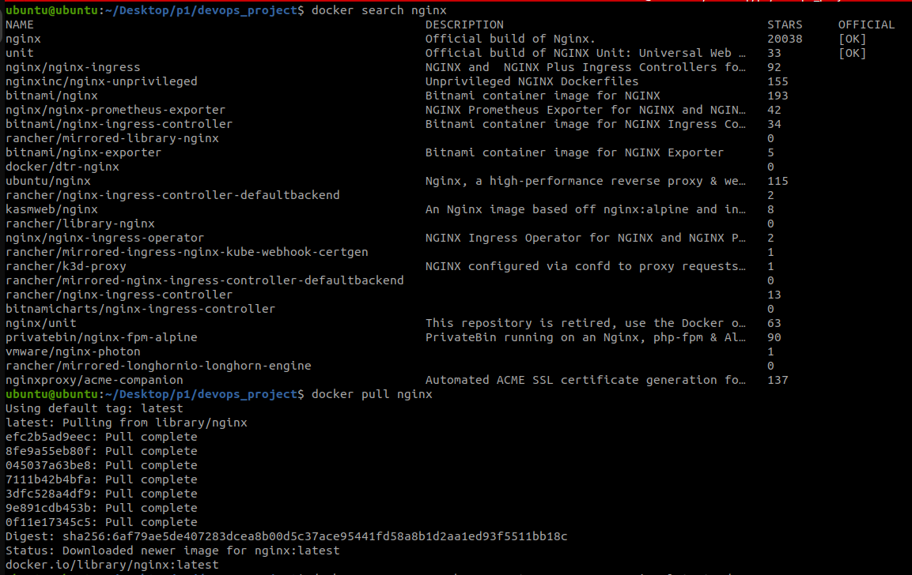

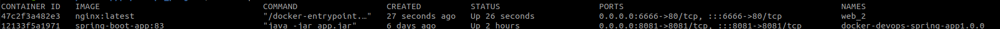

```bash
docker run --name web_2 -p 6666:80 --rm -d nginx:latest
```

## 37.adım: bu github adresindeki veriyi github ile clone yapalım. ve yapılacakları aşağıda yazılmıştır.
- git clone URL_ADDRESS
- bu JAR dosyasının Dockerfile ve docker-compose.yml yazarak image oluşturalım.
- Bu oluşturduğunuz image kendi dockerHub'ta repository'a pushlayalım.
- Kendi repository gönderdiğiniz bu image docker pull … diyerek tekrardan local bilgisayarına veriyi alalım


## 38.adım: SonarQube nedir ? 

- SonarQube, yazılım kodunun kalitesini analiz eden ve teknik borç, güvenlik açıkları, kod kokuları (smells) gibi sorunları raporlayan bir araçtır; sürekli entegrasyon ve sürekli teslimat (CI/CD) süreçlerinde kullanılır.

## 39.adım: Derlenmiş bir kodun statik kod analizini yapalım. 

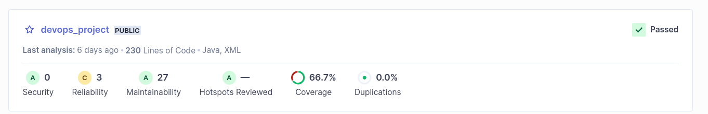

## 40.adım: Bu statik kodlarda smell code, loop, port vs hataları ekran görüntüsünü görelim.


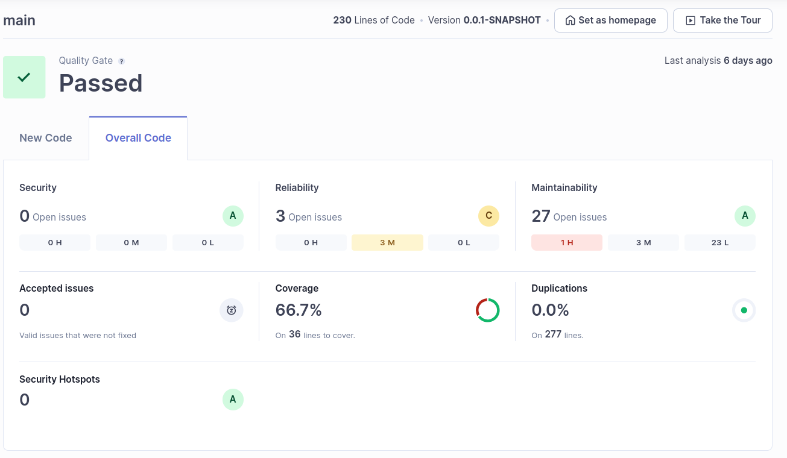

## 41.adım: - GitLab nedir ?

- GitLab, yazılım geliştirme ve versiyon kontrolü için kullanılan bir platformdur; kod depolama, yönetim, işbirliği ve CI/CD özellikleri sunar.

## 42.adım: - GitLab nedir CI/CD nedir ?

- CI/CD (Continuous Integration/Continuous Delivery): Yazılım geliştirme süreçlerinde sürekli entegrasyon ve sürekli teslimat sağlar, kod değişikliklerini otomatik olarak test eder ve dağıtır.

## 43.adım: - GitLab Runner nedir ?

- GitLab Runner, GitLab CI/CD iş akışlarını çalıştıran bir araçtır; test ve derleme işlemlerini gerçekleştirmek için işçi (worker) olarak görev yapar.

## 44.adım: - SSH nedir ?

- SSH (Secure Shell), ağ üzerinden güvenli veri iletimi sağlamak için kullanılan bir protokoldür; genellikle uzak sunuculara güvenli bağlantı kurmak için kullanılır.

## 45.adım: GitLab ve GitHub SSH-keygen oluşturarak bilgisayarınıza bağlayın?

- SSH anahtarları oluşturarak, GitLab ve GitHub'a güvenli bağlantılar kurabilirsiniz. Bu anahtarlar, erişim sağlamak için kimlik doğrulama sağlar.

## 46.adım: Prometheus nedir? Jenkins nedir?

- Prometheus, açık kaynaklı bir izleme ve uyarı sistemidir; metrikleri toplar ve sorgular.

- Jenkins, açık kaynaklı bir otomasyon sunucusudur; CI/CD iş akışlarını otomatikleştirir.

## 47.adım: Ansible nedir?

- Ansible, açık kaynaklı bir otomasyon aracıdır; sistem yapılandırmalarını, uygulama dağıtımlarını ve diğer yönetim görevlerini otomatikleştirir.

## 48.adım: Kubernetes nedir?
- Kubernetes, konteyner orkestrasyon platformudur; konteynerleri dağıtır, yönetir ve ölçeklendirir.

## 49.adım: Datadog Monitoring nedir?

- Datadog Monitoring, bulut tabanlı bir izleme ve analiz platformudur; uygulama performansını, altyapıyı ve logları izler.

## 50.adım: Kanban nedir?

- Kanban, görsel bir iş yönetim sistemidir; görevleri ve iş akışını yönetmek için kullanılan bir yöntemdir.

#### 51.adım: Scrum, Kanban ve Waterfall nedir?

- Scrum: Agile bir proje yönetim metodolojisidir; kısa süreli sprintler içinde iş yapmayı ve sürekli iyileştirmeyi hedefler.
Kanban: İş akışını görselleştiren ve işlerin sürekli olarak akmasını sağlayan bir yöntemdir.
- Waterfall: Geleneksel bir proje yönetim modelidir; proje sürecini sıralı ve lineer aşamalar halinde yürütür.

<p align="center">
  <hr style="width: 100%; border: 1px solid #000;"/>
</p>

<p align="center">
  <strong style="font-size: 60px;">Jenkins-SecOps</strong>
</p>


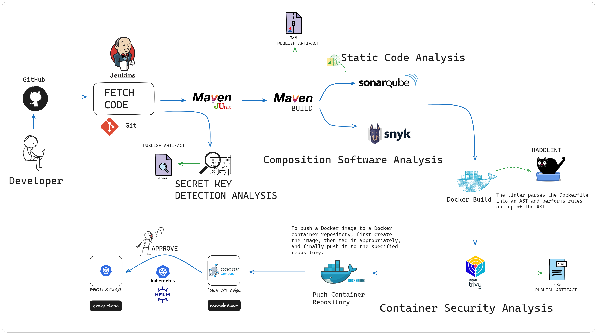

This project contains a Java Spring Boot and PostgreSQL application containerized with Docker running on Kubernetes. Additionally, a SecOps pipeline was established within the project using Jenkins.

## Used technologies

**Technology:** Java, Maven, Spring Boot, Postgresql, Docker, K8S, Jenkins, Snyk Scan, Trivy, Hadolint, SonarQube

**Os:** Ubuntu

## Demo

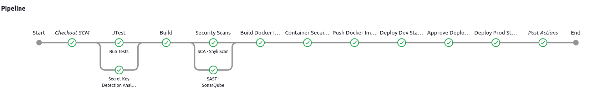

  
## Security

- Pre-commit Secret Detection
- JUNIT (Java Testing Framework)
- SAST (Static Application Security Testing)
- SCA (Software Composition Analysis)
- CSA (Container Security Assessment)
  
## Installation

Clone the project:

```bash
  git clone <project-url>
```

Navigate to the project directory:

```bash
  cd <project-directory>
```

Install the necessary dependencies:


```bash
  mvn package
```

## Step by Step Installation

- 1- We need to install Jenkins.


```
  cd setup/jenkins
  chmod +x install_jenkins.sh
  ./install_jenkins.sh
```

- 2- We need to install Trivy.


```
  cd setup/trivy
  chmod +x install_trivy.sh
  ./install_trivy.sh
```

- 3- We need to install Hadolint.


```
  cd setup/hadolint
  chmod +x install_hadolint.sh
  ./install_hadolint.sh
```

- 4- We need to install Docker and Docker Compose.

  [Docker Installation Guide](https://docs.docker.com/engine/install/ubuntu/)

  [Docker-Compose Installation Guide](https://docs.docker.com/compose/install/linux/)


- 5- We need to install Minikube - k8s.

  [Minikube Installation Guide](https://minikube.sigs.k8s.io/docs/)

- 6- We need to install SonarQube.

```
  cd setup/sonarqube
  docker-compose up -d
```

- 7- We need to install Snyk Scan. (Free-Cloud)

  [Snyk Scan](https://docs.snyk.io/scan-using-snyk)

## 🔗 Links

[](https://tr.linkedin.com/in/ramazanakkulak/)

## Lisans

[MIT](https://choosealicense.com/licenses/mit/)

  